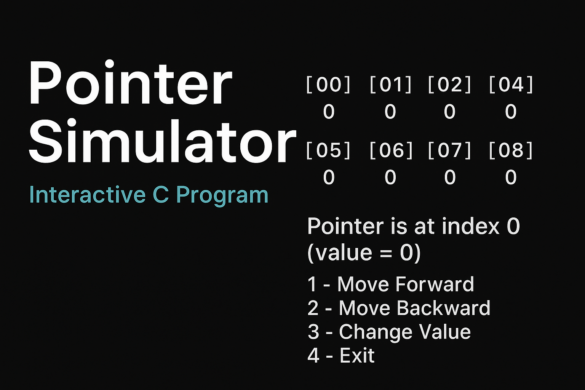
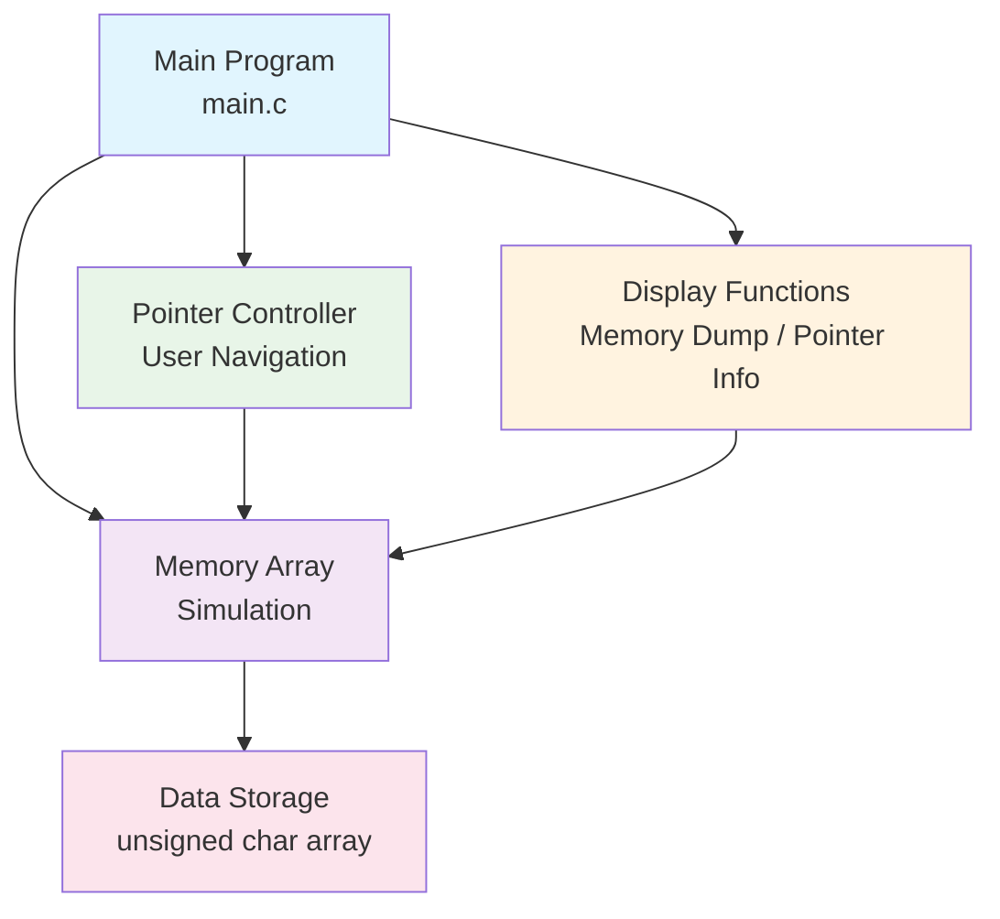

# Pointer Simulator

> An interactive C program that simulates memory pointers, allowing users to navigate, modify, and visualize data in a virtual memory space.



## 📋 Table of Contents

-   [About the Project](#-about-the-project)
-   [Features](#-features)
-   [Technologies Used](#-technologies-used)
-   [Architecture](#-architecture)
-   [Prerequisites](#-prerequisites)
-   [Installation and Setup](#-installation-and-setup)
-   [Usage Examples](#-usage-examples)
-   [Project Structure](#-project-structure)
-   [Configuration](#-configuration)
-   [Contributing](#-contributing)

## 🎯 About the Project

**Pointer Simulator** is a C console application that demonstrates how pointers work in memory.
It creates a simulated block of memory where users can move a pointer, inspect values, and modify data — making it a great educational tool for beginners learning about memory addressing and pointer arithmetic.

### Why use this service?

-   ✅ **Educational:** Understand pointer basics interactively
-   ✅ **Safe Simulation:** No risk of corrupting real memory
-   ✅ **Visual Memory Map:** See how data changes in real time
-   ✅ **Pointer Arithmetic:** Move forward and backward through memory
-   ✅ **Type Awareness** (optional in advanced mode)

## 🚀 Features

### Core Features

-   **Memory Navigation:** Move pointer forward/backward
-   **Value Editing:** Change the value at the current pointer position
-   **Memory Dump:** View all bytes in the simulated memory
-   **Pointer Position Display:** Shows both index and simulated address
-   **Boundary Protection:** Prevents pointer from going out of range

### Advanced Features

-   **Different Data Types:** Switch between char\*, int\*, float\* (planned)
-   **Hexadecimal View:** Display memory contents in hex (planned)
-   **Load/Save State:** Export or import simulated memory state (planned)

## 🛠 Technologies Used

### Backend

-   **C Language** — Core programming language
-   **GCC / MinGW / Clang** — For compiling the program
-   **Make** (optional) — For build automation

## 🏗 Architecture



## 📋 Prerequisites

Before running the program, you need:

-   **C Compiler** (GCC, MinGW, or Clang)
-   **Git** (optional, for cloning)

## 🚀 Installation and Setup

### 1. Clone the Repository

```bash
git clone https://github.com/yourusername/pointer_simulator.git
cd pointer_simulator
```

### 2. Compile the Application

```bash
# Using GCC:
gcc main.c -o main

# Or Windows with MinGW:
gcc main.c -o main.exe
```

### 3. Run the Application

```bash
# Linux/MacOS:
./main

# Or Windows:
main.exe
```

## 💡 Usage Examples

```bash
Memory:
[00]   0    [01]   0    [02]   0    [03]   0
[04]   0    [05]   0    [06]   0    [07]   0

Pointer is at index 0 (value = 0)
1 - Move Forward
2 - Move Backward
3 - Change Value
4 - Exit
Option:
```

## 📁 Project Structure

```
pointer_simulator/
├── main.c    # Main source file
├── README.md              # Project documentation
└── assets/
    └── banner.png         # Project banner

```

## ⚙️ Configuration

The current configuration is minimal — all constants are defined in main.c

```c
#define MEM_SIZE 32 // Total simulated bytes
```

You can increase MEM_SIZE to simulate a larger memory space.

## 🤝 Contributing

Contributions are welcome! To contribute:

1. Fork the project
2. Create a branch for your feature (`git checkout -b feature/new-feature`)
3. Commit your changes (`git commit -m 'Add new feature'`)
4. Push to the branch (`git push origin feature/new-feature`)
5. Open a Pull Request

---

<div align="center">
  <p>Developed with ❤️ by <strong>BortolettoTech</strong></p>
  <p>⭐ If this project was helpful, consider giving it a star!</p>
</div>
